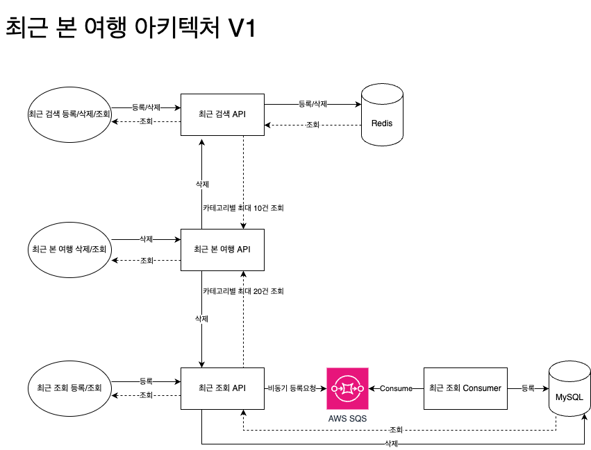
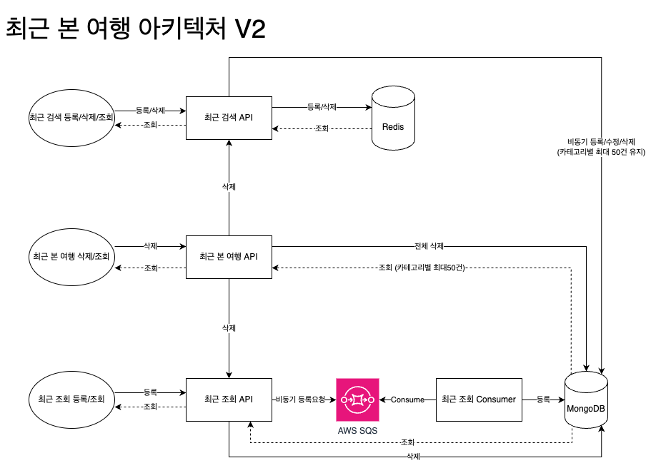
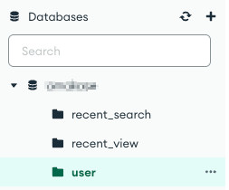

# AWS DocumentDB(MongoDB) 데이터 구조 설계

---

## 🚦 데이터 설계 요건

- 최근 검색, 최근 조회 공통 요건
  - 최대 200건 까지 저장이 되어야 하고 성능에 이슈가 없어야됨
  - 최근 검색, 최근 조회와 조합해서 조회해야되며 성능에 이슈가 없어야됨
  - member_no, idvisitor 별로 데이터를 조회해야됨
  - 비회원 데이터는 30분 후 Expire 되어서 노출이 되지 말아야 하며 로그인시 회원 데이터에 Merge 되어야 함
  - 회원 데이터는 최대 1년간 보관되어야 됨
  - 별도의 배치작업 없이 Expire에 의해 데이터가 정리되어야 함

1. 최근 검색

- 개요
  - 각 카테고리별 최근 검색을 최대 10개까지 저장
  - 저장/수정/삭제가 매우 빈번하게 일어나고 검색 데이터 처리를 위해 매우 빠른 성능을 요하므로 Redis 만으로 캐시 처리

2. 최근 조회

- 개요
  - 최근 조회는 사용자의 마지막 조회 데이터를 활용하기 위해 AWS SQS를 통해 지속적으로 저장하고 있음
  - 조회해올 때는 빠르게 조회하기 위해서 last 테이블에 id_key 별로 최근 20개의 key만 저장
  - 수정이나 삭제가 불가능하고 성능에 이슈가 있을 수 있음

3. 최근 본 여행

- 개요
  - 최근 검색, 최근 조회에 저장된 데이터를 조합해서 최대 100건의 데이터를 조회
  - 각각의 항목들은 세부 정보도 별도로 제공이 되어야 함
- 요건
  - 최대 100건이지만 조회 개수가 늘어날 수도 있음
  - 각 회원 별로 자신의 최근 데이터들을 조회해야되며 성능에 이슈가 없어야됨

---

## 🚦 2. Database 선정 및 비용 산정

- 참고
  - https://aws.amazon.com/ko/documentdb/pricing/

### 📌 데이터 구조 개선을 위한 Database 검토

#### ► 비용 산정 데이터 기준
- JSON DATA 100건(35.55KB)
- 하나의 회원이 총 400건의 데이터를 보관(142.2KB)
- 3,000,000 회원 기준 총 데이터 예상
  - 406.84 GB(426,600,000 KB)

#### ► Amazon DocumentDB

- **Standard**
  - I/O 사용량이 보통 수준(I/O 비용이 총 데이터베이스 비용의 25% 미만)인 많은 애플리케이션에 대해 비용 효율적인 요금입니다
  - 요청당 지불 I/O 요금이 적용됩니다. DB 인스턴스 및 스토리지 가격에는 I/O 사용량이 포함되지 않습니다
- **I/O 최적화**
  - 모든 애플리케이션에 대해 요금을 예측할 수 있습니다. I/O 집약적 애플리케이션(I/O 비용이 전체 데이터베이스 비용의 25%를 초과함)의 가격 대비 성능이 향상되었습니다.
  - 읽기/쓰기 I/O 작업에 대한 추가 비용은 없습니다. DB 인스턴스 및 스토리지 요금에는 I/O 사용량이 포함됩니다

| 인스턴스           | 메모리    | vCPU | Standard(시간당) | I/O 최적화(시간당) |
|----------------|--------|------|---------------|--------------|
| db.r6g.xlarge  | 32GiB  | 4    | 0.526 USD     | 0.579 USD    |
| db.r6g.2xlarge | 64GiB  | 8    | 1.053 USD     | 1.158 USD    |
| db.r6g.4xlarge | 128GiB | 16   | 2.105 USD     | 2.316 USD    |
| db.r6g.8xlarge | 256GiB | 32   | 4.210 USD     | 4.631 USD    |

- Standard 비용
  - 인스턴스 비용
  - db.r6g.xlarge  32GiB  4vCPU **463.26 USD (615,455 원)**
  - I/O 비용
    - 일별 700,000건 월별 21,000,000건 **149.04 USD (198,004 원)**
  - 스토리지 비용
    - 450GB **10.35 USD (13,750 원)**
  - 총 월별 예상 비용
    - **622.65 USD (827,209 원)**

#### ► Amazon DynamoDB

- 참고
  - https://aws.amazon.com/ko/dynamodb/pricing/

##### On-demand

DynamoDB의 온디맨드 용량 모드에서는 해당 애플리케이션이 테이블에서 수행하는 데이터 읽기 및 쓰기에 대해 요금이 부과됩니다. DynamoDB가 워크로드의 요구 사항에 따라 즉시 조정되므로 읽기 또는 쓰기 용량을 지정하지 않고도 시작할 수 있습니다

온디맨드 용량 모드는 다음 경우에 적합할 수 있습니다

- 알 수 없는 워크로드를 포함하는 테이블을 새로 만들 경우
- 애플리케이션 트래픽이 예측 불가능한 경우
- 사용한 만큼에 대해서만 지불하는 요금제를 사용하려는 경우


- 데이터 스토리지 비용
  - 400 GB x 0.27075 USD = 108.30 USD(데이터 스토리지 비용)
  - **DynamoDB 데이터 스토리지 비용 (월별): 108.30 USD (143,896 원)**
- 쓰기
  - 표준 쓰기: 100 / 100 = 1
  - 트랜잭션 쓰기: 0 / 100 = 0
  - 쓰기 수: 100000 일별 * (730 시간(1달 기준) / 24 시간(하루 기준)) = 3041666.6667 월별
  - 456,250,000.005 총 쓰기 요청 단위 x 0.0000013556 USD = 618.49 USD 쓰기 요청 비용
  - **월별 쓰기 비용 (월별): 618.49 USD**
- 읽기
  - 최종적 일관성 비율: 100 / 100 = 1
  - 강력한 일관성 비율: 0 / 100 = 0
  - 트랜잭션 비율: 0 / 100 = 0
  - 읽기 수: 600000 일별 * (730 시간(1달 기준) / 24 시간(하루 기준)) = 18250000 월별
  - 346,750,000.00 총 읽기 요청 단위 x 0.000000271 USD = 93.97 USD 읽기 요청 비용
  - **월별 읽기 비용 (월별): 93.97 USD**
- 총 월별 예상 비용
  - **820.76 USD (1,093,556 원)**

##### Provisioned

프로비저닝 용량 모드에서는 애플리케이션에서 필요한 초당 읽기 및 쓰기 수를 지정해야 합니다. Auto Scaling을 사용하여 지정된 사용률을 기준으로 테이블의 용량을 자동으로 조정하여 비용을 절감하면서 애플리케이션 성능을 보장할 수 있습니다

프로비저닝 용량 모드는 다음 경우에 적합할 수 있습니다

- 애플리케이션 트래픽이 예측 가능한 경우
- 트래픽이 일관되거나 점진적으로 변화하는 애플리케이션을 실행할 경우
- 비용 관리를 위해 용량 요구 사항을 예측할 수 있는 경우


### 📌 DocumentDB 선정 이유

| 구분   | DynamoDB                                                                                              | DocumentDB                                                                                                        |
|------|-------------------------------------------------------------------------------------------------------|-------------------------------------------------------------------------------------------------------------------|
| 리전   | 모든 리전에서 사용가능                                                                                          | 오항이오, 버지니아, 아일랜드, 프랑크푸르트, 오레곤 등 특정 리전에서만 사용가능.                                                                    |
| 자걱증명 | AWS Identity and Access Management(IAM)를 통해 데이터베이스에 대한 액세스를 제어                                        | 데이터베이스에서 User를 생성하고 관리.<br/>자격증명이 DB에 직접 저장되기 때문에 AWS는 이 영역에 관여하지 않음.                                             |
| 금액   | 최소 월 1$<br/>서버리스 서비스로 사용량에 따라 요금이 책정.<br/>주요 비용은 읽기/쓰기 용량 단위.<br/>비용을 예상하기 어려움.<br/>스토리지 25GB를 무료로 제공 | 최소 월 200$<br/>노드 또는 EC2 인스턴스당 비용을 지불.<br/>데이터베이스의 일부 인스턴스만 사용하거나 몇시간만 사용하더라도 전체 요금을 지불해야함.<br/>스토리지는 무료로 제공되지 않음. |
| 백업   | 매일 백업을 사용할 수 없어 사용자가 백업을 진행.<br/>데이터에서 지원하는대로  필요할 때 데이터를 복구할 수 있음.                                   | 데이터베이스 자체에서 일일 백업을 관리하고 필요할 때 마다 복구할 수 있음.<br/>모든 유형의 백업이 지원됨.                                                    |

데이터가 많지 않고 I/O를 예측할 수 있으며 가볍게 사용하기에는 DynamoDB가 좋을 수 있음

하지만 I/O를 예측하기 힘들고 데이터 양이 많다면 I/O에 따라 DynamoDB는 엄청난 요금 폭탄을 맞을 수 있음

또한 MongoDB 기반으로 AWS에서 특별한 용도로 제공하는 Database 서비스로 대부분 MongoDB와 호환이 되지만 정확한 MongoDB 버전을 확인하기 힘들고 MongoDB의 오퍼레이션들이 전부 동작하리라 기대하기 힘듬

또한 MongoDB와는 다른 부분들도있어 MongoDB와 동일하게 사용했을 때도 성능을 보장하기 힘듬

비용적인 면에서 초기에 데이터 양이 작을때는 DynamoDB를 이용하는 것이 좋아보이기는 하나 차후 마이그레이션 까지 고려한다면 번거로운 문제가 발생할 수도 있고 호환이 된다고는 하지만 DynamoDB로 개발된 모든 기능이 호환되리라는 보장은 없음

차후 마이그레이션을 위한 재개발 비용까지 생각한다면 처음부터 DocumentDB로 선정하여 개발하는 것이 더 낫다고 판단함

---

## 🚦 3. 아키텍처 설계

### 📌 최근 본 여행 아키텍처 V1 (변경 전)

- 최근 본 여행용 데이터를 조회하기 위해 최근 검색 Redis와 최근 조회 MySQL을 각각 조회해서 병합작업을 진행
- 최근 조회의 Expired 처리를 위해서 매번 조회시 Expired 데이터인지 확인하여 Cleansing 처리
- 현재 각각 설정된 카테고리별 최대 갯수 (최근 검색: 10건, 최근 조회: 20건) 이상의 데이터를 관리하기 어려움




### 📌 최근 본 여행 아키텍처 V2 (변경 후)

- 최근 조회 DB가 MySQL → MongoDB 로 변경됨
- 기본적으로 MongoDB는 **WiredTiger 엔진**을 사용하여 내부 캐시와 파일 시스템의 캐시를 둘다 사용하는 고성능 데이터베이스로 RDBMS 보다 빠르고 대용량 트래픽 처리에 용이함
- 최근 본 여행용 최근 검색 데이터도 MongoDB 에 추가로 적재/관리 함
- 최근 검색/최근 조회 각각 카테고리별로 최대 50건씩 저장가능
- 최근 본 여행 조회/전체 삭제시 MongoDB 에서 한번 조회/전체 삭제 처리를 하므로 성능이 대폭 향상될 것으로 예상
- MongoDB는 Document(Row) 단위로 Expired 처리가 가능하여 현재의 MySQL에서 하고 있는 Cleansing 처리를 제거해도 됨

- 참고
  - https://woojinger.tistory.com/108
  - https://sjh836.tistory.com/98
  - https://aws.amazon.com/ko/compare/the-difference-between-redis-and-mongodb/
  - https://velog.io/@fcfargo/TIL-MongoDB
  - https://www.mongodb.com/resources/compare/relational-vs-non-relational-databases



---

## 🚦 4. Schema 설계

### 📌 현재 최근 본 여행 데이터 구조 참고

```json
[
  {
    "group_date": "2024-04-08",
    "now": false,
    "items": [
      {
        "item_type": "view",
        "item_at": "2024-04-08T01:41:53.502",
        "item_id": "package⎮package⎮int⎮21560-106783_4796701",
        "view": {
          "location": "package",
          "viewType": "package",
          "id": "21560-106783_4796701",
          "sale_price": 749000,
          "represent_product_code": "21560-106783",
          "sale_product_code": "4796701",
          "sale_product_name": "[기타큐슈 3일] 기분전환 그리고 휴식, 벳부+유후인+기타큐슈",
          "departure_day": "2024-10-25",
          "travel_day_count": "3",
          "travel_night_count": "2",
          "represent_image_url": "https://tripbox.cache-front.iwinv.net/1024/1/Place/GettyImages-1005106620.jpg",
          "locale_type": "int",
          "sold_out": false,
          "ttl": "348d",
          "expired_at": "2025-04-08T01:41:53.502",
          "updated_at": "2024-04-08T01:41:53.502"
        }
      }
    ]
  },
  {
    "group_date": "2024-04-05",
    "now": false,
    "items": [
      {
        "item_type": "search",
        "item_at": "2024-04-05T14:27:28.985",
        "item_id": "package⎮area⎮⎮-984098047",
        "search": {
          "location": "package",
          "search_type": "area",
          "keyword": "북해도, 일본",
          "id": "-984098047",
          "options": "{'code':'ICN/GMP','name':'인천/김포'}",
          "to": "2024-05-20",
          "data": "296",
          "ttl": "346d",
          "expired_at": "2025-04-05T14:27:41.28",
          "updated_at": "2024-04-05T14:27:28.985"
        }
      },
      {
        "item_type": "search",
        "item_at": "2024-04-05T14:26:04.445",
        "item_id": "package⎮area⎮⎮1479808",
        "search": {
          "location": "package",
          "search_type": "area",
          "keyword": "도쿄",
          "id": "1479808",
          "data": "100276,12287,100285",
          "ttl": "346d",
          "expired_at": "2025-04-05T14:27:41.28",
          "updated_at": "2024-04-05T14:26:04.445"
        }
      },
      {
        "item_type": "view",
        "item_at": "2024-04-05T14:19:57.974",
        "item_id": "hotel⎮hotel⎮dom⎮714643",
        "view": {
          "location": "hotel",
          "type": "hotel",
          "id": "714643",
          "city_master_id": 15754,
          "upper_city_master_id": 690,
          "city_name_kr": "서귀포시",
          "city_name_en": "제주도/서귀포시",
          "disp_city_name_en": "seogwipo-si",
          "area_name": "제주도",
          "nation_code": "KR",
          "nation_name_kr": "한국",
          "main_img": "https://thumb.tidesquare.com/raw/https%3A%2F%2Fcdnph.tidesquare.com%2F%2Fparagon%2Ffile%2FhotelImg%2F714643%2F20231031032545611.jpg?type=om_mo_big",
          "sale_price": 566750,
          "city_name": "서귀포시",
          "nation_name_en": "Korea",
          "normal_price": 574750,
          "discount_rate": "1",
          "rating_average": 4.6,
          "reviews_count": 83,
          "htl_master_id": 714643,
          "htl_name_kr": "파르나스 호텔 제주",
          "htl_name_en": "Parnas Hotel Jeju",
          "htl_category": "20200009",
          "htl_category_name_kr": "호텔",
          "htl_grade": "5",
          "htl_review_rating_data": [
            {
              "htl_master_id": 714643,
              "rating_average": "4.6",
              "review_text": null,
              "reviews_count": "75",
              "supplier_htl_code": null,
              "supplier_type": "Expedia"
            },
            {
              "htl_master_id": 714643,
              "rating_average": "5.0",
              "review_text": null,
              "reviews_count": "8",
              "supplier_htl_code": null,
              "supplier_type": "Tourvis"
            }
          ],
          "locale_type": "dom",
          "sold_out": false,
          "ttl": "346d",
          "expired_at": "2025-04-05T14:19:58.265",
          "updated_at": "2024-04-05T14:19:57.974",
          "search": {
            "location": "hotel",
            "search_type": "hotel",
            "nation_code": "KR",
            "division": "hotel",
            "keyword": "파르나스 호텔 제주, 서귀포시, 한국",
            "id": "714643",
            "options": "2~2,3~10,4~11",
            "from": "2024-12-28",
            "to": "2024-12-31",
            "ttl": "346d",
            "expired_at": "2025-04-05T14:19:58.265",
            "updated_at": "2024-04-05T14:19:57.974"
          }
        }
      }
    ]
  }
]
```

### 📌 최근 검색, 최근 조회, 최근 본 여행 MongoDB 데이터 설계

각유저의 데이터들을 모두 보관해야 하므로 Reference 타입의 Document 로 구성

#### ► MongoDB 설계 대상 객체 및 속성

- 최근 본 여행 Document: `recent-view-trip`
  - `id`: `member_no`, `idvisitor`
  - `group_date`: 그룹 일자
  - `now`: 오늘 여부
  - `items`: 최근 본 여행 아이템 리스트
  - `site`: 사이트
  - `item_type`: 타입 (VIEW: 조회, SEARCH: 검색)
  - `item_at`: 최근 본 여행 아이템 일시
  - `item_id`: 최근 본 여행 아이템 ID (각 아이템별 검색/조회위치⎮타입|ID 값을 조합하여 아이템 ID를 생성)
  - `view`: 최근 조회 데이터 (type = VIEW 이면 최근 조회 데이터가 존재)
  - `search`: 최근 검색 데이터 (type = SEARCH 최근 검색 데이터가 존재)
- 최근 검색 Ref Document: `recent-search`
  - KEY: database:recent:test:package:m:20230822101306776
  - VALUE: 1||7||[코타키나발루] 수트라하버 마젤란 3박5일+자유일정|3417666|||2024-03-31|2024-04-04||||4878-74071||
  - 데이터
    - `version`: 버전
    - `location`: 검색 위치 (air: 항공, hotel: 숙소 , toact: 투어&티켓, place: 플레이스, package: 패키지)
    - `search_type`: 검색 타입 (air: 1, city: 2, hotel: 3, keyword: 4, category: 6, product: 7, place: 8, area: 9)
    - `nation_code`: 국가 ex) KR
    - `division`: 검색 구분 ex) hotel
    - `keyword`: 키워드명 ex) 제주도 전체, 한국
    - `id`: 키워드 ID
    - `urid`: 키워드 URID
    - `options`: 옵션 숙소(객실 인원 ex) 2~2,3~10,4~11)
    - `from`: 시작일 (YYYY-MM-DD) ex) 2024-12-28
    - `to`: 종료일 (YYYY-MM-DD) ex) 2024-12-31
    - `code`: 코드 ex) jejudo
    - `data`: 데이터 `ex) {"ICN":"서울(인천)","NRT":"도쿄(나리타)","LAX":"로스앤젤레스"}`
    - `name`: 이름 또는 표시 이름
    - `parent`: 부모 ID 또는 데이터
    - `type`: 키워드 타입
    - `etc`: 기타
    - `ttl`: 최근 검색 TTL (만료까지 남은시간)
    - `expired_at`: 최근 검색 만료일시 (만료될 일시)
    - `updated_at`: 최근 검색 수정일시
- 최근 조회 Ref Document: `recent-view`
  - `id_type`: 아이디 타입 (M: 회원번호, V: 브라우저아이디)
  - `id_key`: 회원번호 또는 브라우저아이디
  - `view_type`: 마지막으로 조회한 Object 타입 (CITY, HOTEL, TOACT, AIRPORT, PACKAGE)
  - `locale_type`: 국내,해외 구분 (DOM, INT)
  - `location`: 데이터 수집위치 (COMM, HOTEL, TOACT, PLACE, AIR, PACKAGE)
  - `id`: 마지막으로 조회한 id
  - `last_view_ts`: 마지막으로 조회한 시각
  - `dep_dt`: 가는날 (YYYY-MM-DD)
  - `ret_dt`: 오는날 (YYYY-MM-DD)

#### ► MongoDB Document 설계

- 최근 본 여행 Document 구조는 **id_key** 기준으로 각각 최근 검색과 최근 조회를 포함하고 있는 구조
- **id_key** 별로 최근 검색, 최근 조회 수정과 삭제가 빈번하게 일어나고 Expired 정책 설정도 필요함
- 최근 검색, 최근 조회에 각각 빈번하게 수정/삭제가 일어남
- 최근 검색, 최근 조회가 **부모만을 참조**하는 **부모 참조 레퍼런스 방식**으로 설계하여 **부모의 변경 부담은 제거**함
- 참고
  - https://code-masterjung.tistory.com/77
  - https://meetup.nhncloud.com/posts/276

##### 최근 본 여행 Database 구조

- [DocumentDB 접속 설정 및 Aggregation 조회](DocumentDB_Environment.MD)



##### 최근 본 여행 Collection 구성

###### 유저 컬렉션

- Database(Schema): `database`
- Collection(Table): `user`
- Document(Row)
  ```json
  
  {
    "_id": "20230822101306774",
    "type": "M",
    "updatedAt": {
      "$date": "2024-05-16T08:31:39.936Z"
    },
    "expiredAt": {
      "$date": "2025-05-16T08:31:39.916Z"
    },
    "last_views": ["$ref: recent_view_id1", "$ref: recent_view_id2"], // 마지막 조회 20개 유지
    "_class": "com.example.database.api.domain.recent.entity.UserEntity"
  }
  ```
  
###### 최근 조회 컬렉션

각 카테고리별로 50개씩 보관, 최근 검색은 20건만 제공

- 삭제
  - `recent_view` Collection 에서 제거
  - `users.last_views` 에도 있으면 제거
- 추가
  - `recent_view` Collection 에 추가
  - `users.last_views` 20개만 유지 없으면 추가 있으면 변동없음


- Database(Schema): `database`
- Collection(Table): `recent_view`
- Document(Row)
  ```json
  {
    "_id": {
      "site": "test",
      "userType": "M",
      "userId": "20230822101306774",
      "viewType": "PACKAGE",
      "localeType": "INT",
      "location": "PACKAGE",
      "id": "21560-106783_4796701"
    },
    "groupDate": {
      "$date": "2024-05-15T15:00:00.000Z"
    },
    "viewType": "PACKAGE",
    "localeType": "INT",
    "location": "PACKAGE",
    "id": "21560-106783_4796701",
    "updatedAt": {
      "$date": "2024-05-16T08:31:40.050Z"
    },
    "expiredAt": {
      "$date": "2025-05-16T08:31:40.050Z"
    },
    "user": {
      "$ref": "user",
      "$id": "20230822101306774"
    },
    "_class": "com.example.database.api.domain.recent.entity.RecentViewEntity"
  }
  ```
  
###### 최근 검색 컬렉션

각 카테고리 별로 50개씩 보관, 마지막 조회는 10건만 제공

- Database(Schema): `database`
- Collection(Table): `recent_search`
- Document(Row)
  ```json
  {
    "_id": {
      "site": "test",
      "location": "PACKAGE",
      "searchType": "PRODUCT",
      "userType": "M",
      "userId": "20230822101306774",
      "id": "3417666"
    },
    "groupDate": {
      "$date": "2024-06-29T15:00:00.000Z"
    },
    "location": "PACKAGE",
    "searchType": "PRODUCT",
    "keyword": "[코타키나발루] 수트라하버 마젤란 3박5일+자유일정+18",
    "id": "3417666",
    "from": "2024-03-31",
    "to": "2024-04-04",
    "parent": "4878-74071",
    "updatedAt": {
      "$date": "2024-06-30T10:17:29.781Z"
    },
    "expiredAt": {
      "$date": "2025-06-30T10:17:29.777Z"
    },
    "user": {
      "$ref": "user",
      "$id": "20230822101306774"
    },
    "_class": "com.example.database.api.domain.recent.entity.RecentSearchEntity"
  }
  ```